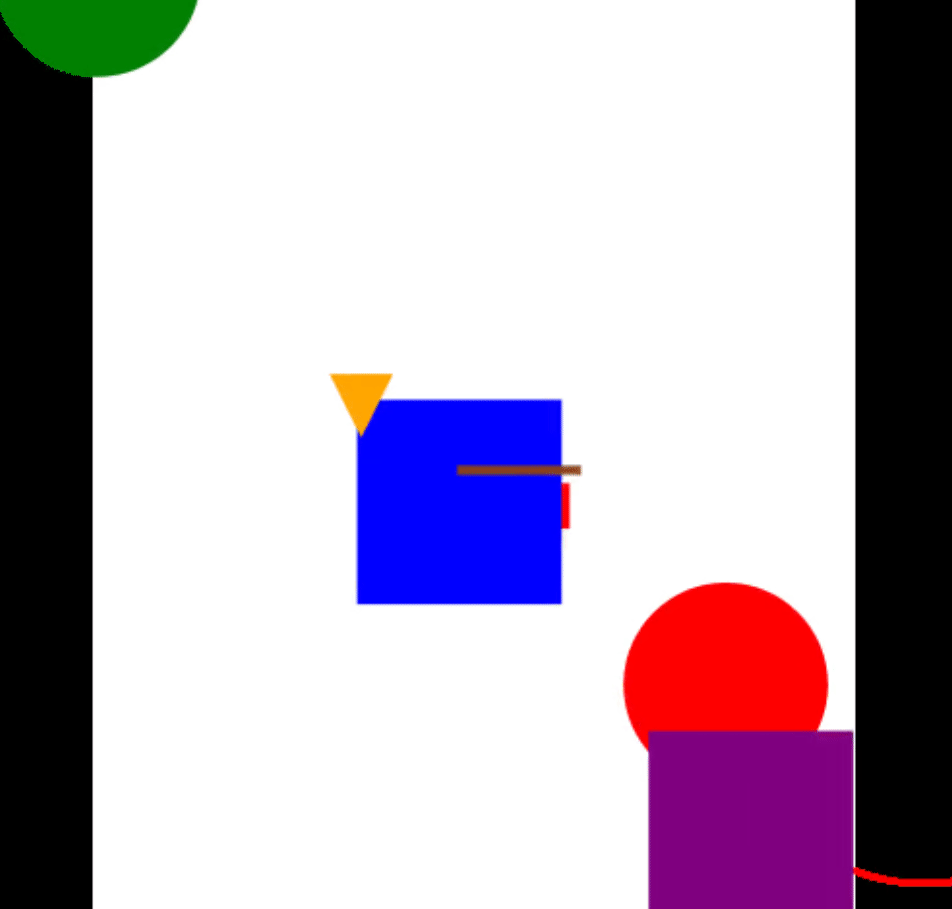
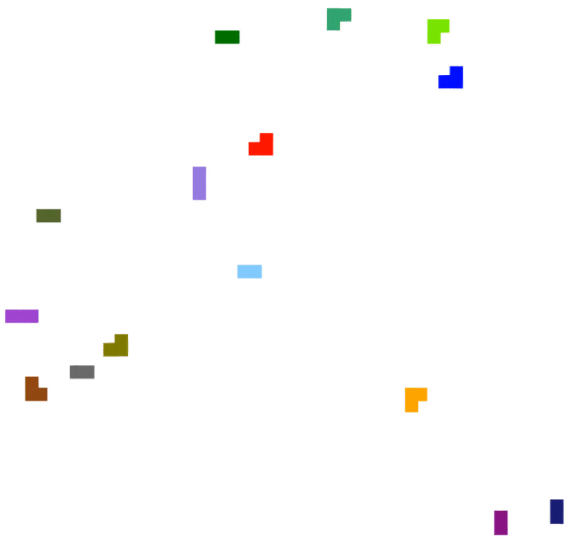

# SVGVideoMaker

## About

The aim of this project is to write easy animation from description of position.
To do that, we use svg structure.  
You create shape like circle, point, polygon, rectangle... and add animation by key time (in second).

## Documentation 

You can have full documentation if you execute command :  
> python -m sphinx -b /path/to/SVGVideoMaker/Documentation /path/to/SVGVideoMaker/Documentation/html

## Shapes 

Available shapes :

-   Circle
-   Rectangle
-   Polygon
-   Arc
-   Segment

You can also made group who contain shape.

## Available operation on shape

-   Translation
-   Inflation
-   Reshaping (for polygon)

## Debug your program

### Warnings
Terminal supported for image displaying : **Terminology**, **Kitty** and others terminal can display pseudo image if you have ***viu*** installed. For viu, you can see the git [here](https://github.com/atanunq/viu).

You can get all keyframe for an element with `display_animations()` method on svg element.
You can display a svg element in terminal with `display(svg_element)` and you can display specific frame of a SVGVideoMaker with `print_frame(nb_frame:int)` and the number of frame to display.

## Examples

See video in examples file.

### Misc

This example illustrate divers function you can use with this API.

### Voronoi

This example is an implementation of Voronoi diagram.

### Game

This example is an implementation of territory battle.

 
